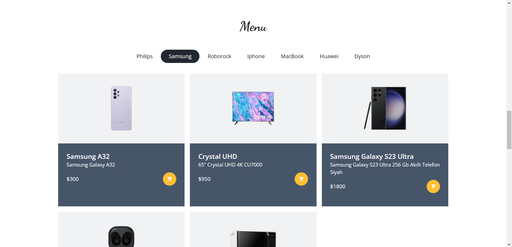

# E-Commerce Site
* The technologies I used in this project are: Next.js, React.js, Node.js, MongoDb, TailwindCss and Redux.
* This site is a Full Stack e-commerce site. After registering, the user can log in and order a product easily. Admin can update components such as Category, Product, Footer. He can add a new product or delete the existing product. He can see the order from the user and manage the order.

